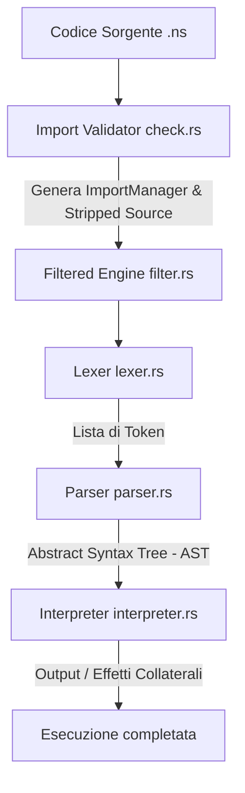

# Documentazione Tecnica di Progetto: NodeStract (NS)

Questo documento descrive in dettaglio l'architettura interna, le scelte di progettazione e il funzionamento del compilatore/interprete del linguaggio **NodeStract (NS)**, sviluppato in Rust.

---

## 1. Architettura del Sistema

L'interprete di NodeStract è strutturato come una pipeline lineare suddivisa in fasi distinte. Ciascuna fase si occupa di un aspetto specifico della validazione, della traduzione e dell'esecuzione del codice sorgente.

### 1.1 Moduli Principali

Il compilatore è organizzato nei seguenti moduli Rust sotto la cartella `src/`:

1. **`engine.rs`**: Il punto di ingresso orchestratore che coordina il passaggio dei dati tra la fase di controllo degli import, la tokenizzazione, il parsing e l'esecuzione.
2. **`import/`** (Import Manager):
   * `check.rs`: Analizza le prime righe del file sorgente per convalidare la sintassi degli import. Popola l'oggetto `ImportManager` ed elimina le righe di importazione per passare al lexer solo il codice da interpretare.
   * `import.rs`: Gestisce lo stato delle importazioni attive (quali lingue e quali funzioni built-in sono autorizzate). Legge le dipendenze consentite dal file statico `import.json`.
3. **`translate/`** (Translation Engine):
   * Carica a tempo di compilazione (tramite la macro `include_str!`) i dizionari JSON delle lingue supportate (`languages/`).
   * Fornisce la funzione di normalizzazione dei caratteri accentati (es. `SÉ` -> `se`) e converte le parole chiave localizzate nella loro forma canonica inglese.
4. **`filter/`** (Filtered Engine):
   * Costruisce un vocabolario di parole chiave attive basato esclusivamente sulle lingue e sui moduli importati dall'utente in testa al file sorgente.
5. **`lexer/`** (Lexer / Analizzatore Lessicale):
   * Spezza il sorgente in token generici (`Keyword`, `Identifier`, `StringLiteral`, `Number`, `Delimiter`, `Operator`).
   * Legge gli operatori e i delimitatori da file di configurazione JSON esterni (`operators.json` e `delimiters.json`).
6. **`parser/`** (Parser / Analizzatore Sintattico):
   * `parser.rs`: Esegue un pre-controllo di bilanciamento dei delimitatori (parentesi e graffe) e blocca l'uso di parole chiave protette come nomi di variabili.
   * `statement.rs` & `expression.rs`: Implementano l'algoritmo di parsing ricorsivo a discesa (Recursive Descent Parsing) per strutturare i token in un albero di sintassi astratta (AST).
7. **`ast/`** (Abstract Syntax Tree):
   * Definisce le strutture dati (`Statement` ed `Expression`) che rappresentano la struttura logica del codice.
8. **`interpreter/`** (Interprete):
   * Valuta l'AST riga per riga. Gestisce la tabella dei simboli dei vari scope (`scopes: Vec<HashMap<String, VarEntry>>`) e implementa il motore di esecuzione per le operazioni matematiche, I/O, file system e di rete.

---

## 2. Dettaglio delle Fasi di Esecuzione

### Fase 1: Validazione e Isolamento degli Import (`check.rs`)
Prima che il codice venga esaminato dal lexer, NodeStract scansiona il sorgente riga per riga partendo dall'inizio. 
* Si aspetta una sequenza contigua di istruzioni di tipo `import` / `importa` (o equivalenti in altre lingue).
* Non appena incontra una riga che non sia un import, un commento o una riga vuota, la fase di importazione si considera chiusa. Qualsiasi tentativo di inserire un import successivo causerà un errore di compilazione.
* In questa fase viene verificato che almeno una lingua sia stata importata dal modulo `translate`.

### Fase 2: Traduzione e Filtro Lessicale (`filter.rs` & `translate.rs`)
Il `TranslationEngine` normalizza il testo rimuovendo gli accenti e rendendo tutto minuscolo. 
Il `FilteredEngine` crea una mappa contenente solo le traduzioni attive per la sessione corrente. Ad esempio, se l'utente ha importato solo la lingua `italian`, la parola `se` verrà registrata e mappata sul token canonico `Keyword("if")`. La parola inglese `if` rimarrà invece un identificatore comune (`Identifier("if")`), privo di significato sintattico.

### Fase 3: Analisi Lessicale (`lexer.rs`)
Il Lexer converte la stringa di testo sorgente in un vettore di Token. 
* I numeri e le stringhe letterali vengono estratti.
* Gli identificatori vengono confrontati con il `FilteredEngine`: se corrispondono ad una parola chiave attiva, vengono convertiti nel rispettivo token canonico `Keyword`. Altrimenti, rimangono semplici identificatori (`Identifier`).

### Fase 4: Analisi Sintattica (`parser.rs`)
Il Parser riceve i token ed esegue due controlli principali prima di costruire l'AST:
1. **Pre-check di Bilanciamento**: Utilizza uno stack per verificare che tutte le parentesi tonde, quadre e graffe siano correttamente aperte e chiuse nell'ordine giusto.
2. **Pre-check dei Nomi**: Impedisce la dichiarazione di variabili o funzioni con nomi che coincidono con parole chiave del linguaggio.
Una volta superati i controlli, genera l'AST in base alla precedenza degli operatori (tramite parser ricorsivo a discesa).

### Fase 5: Esecuzione dell'Interprete (`interpreter.rs`)
L'interprete esegue le istruzioni dell'AST.
* La tabella dei simboli è memorizzata in un vettore di mappe (`scopes`). Ogni blocco (`{ ... }`) o chiamata di funzione spinge una nuova mappa nel vettore per gestire la visibilità locale.
* L'interprete registra le definizioni di funzione e **esegue sempre** le istruzioni globali non-funzione (dichiarazioni di variabili, espressioni). Se nel file sorgente è presente una funzione di nome `main`, ne esegue inoltre il corpo come punto di ingresso principale del programma.

---

## 3. Scelte Progettuali e Motivazioni

* **Scelta di Rust**: Rust è stato scelto per l'ottima gestione della memoria senza garbage collector e per la robustezza del sistema dei tipi, che garantisce l'assenza di crash imprevisti durante il parsing. Inoltre, le macro di Rust consentono di includere risorse statiche (i dizionari delle traduzioni) direttamente dentro il binario finale a tempo di compilazione.
* **Grammatica Multi-Lingua Dinamica**: Progettata per scopi didattici al fine di esplorare come i compilatori convertono stringhe arbitrarie in token logici astratti. Invece di riscrivere 7 lexer diversi, il sistema unifica tutto traducendo i lessemi localizzati in costrutti canonici inglesi prima del parsing.
* **Separazione dei Moduli Built-in**: La necessità di importare esplicitamente librerie come `nio` o `nmath` serve a mostrare agli studenti l'importanza del principio del minor privilegio (least privilege) e come isolare le capacità esterne (I/O, filesystem, rete) in un interprete protetto.
